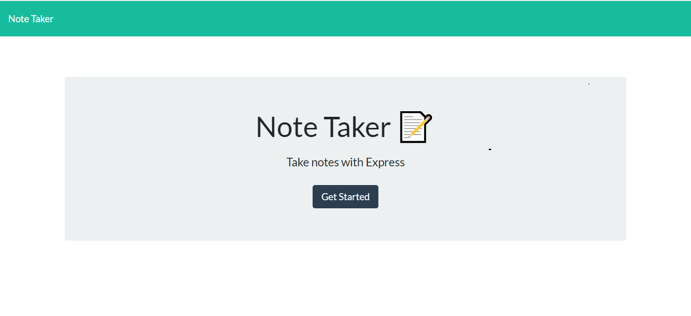
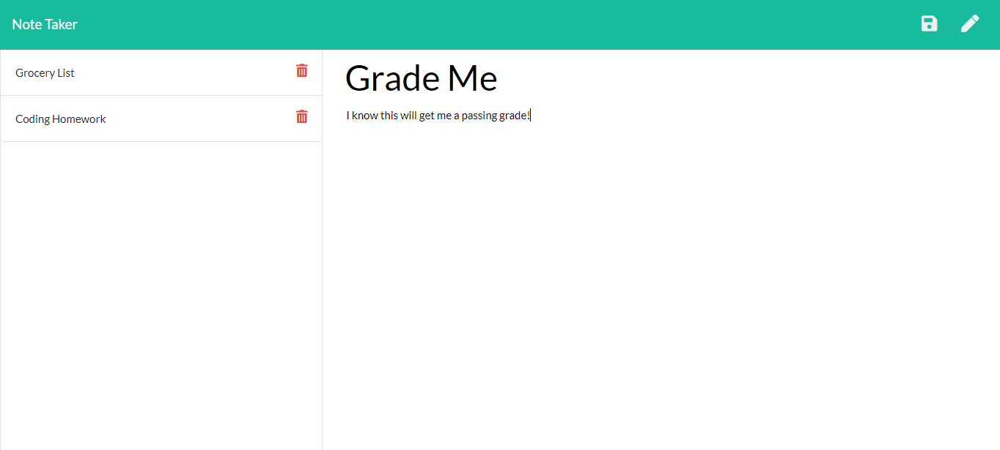

# noteTaker

### A project by Jack Sorensen

## Table of Contents

[Description](#Description)

[Technology](#Technology)

[Feedback](#Feedback)

[Thoughts](#Thoughts)

### Description

Create an application that can be used to write, save, and delete notes. This application will use an express backend and save and retrieve note data from a JSON file.

This project is for users that need to keep track of a lot of information, it's easy to forget or be unable to recall something important. Being able to take notes, make lists, or write reminders allows users to have access to a tool for helping optimize their day and organize their lives.

Here is a picture of note taker in action. In the center of your screen, you add in a title and then add in all your notes underneath it. When you click the save icon on the top left portion of the screen, it will save your note in the column on the left. If you want to remove an item from your notes, just click the trashcan icon on your note, and its gone!

### Technology

Express.js is used for building web applications and APIs.

Node.js allows us to execute JavaScript code outside of a browser.

### Feedback

I really enjoyed this project because it was very different than what we have done so far. All of the web design and javaScript were already finished, so that let us really concentrate on the server side of things. 

One thing that actually made it more challenging in a way was the fact that someone else wrote out the front end code. It took a while of reading through what they had wrote and figuring out what they had designated their variables as before I could start tying things together. Thankfully, the person who wrote this particular code had thought about that as they were writing it, but I can see how working in some situations, this project would be a whole lot different with terribly named variables. That is a good lesson for me as well. **Name your variables as clearly as possible**.

### Thoughts

First, I need to thank Chris P. During an in class activity, he slacked out a line of code to me while I was confused on where exactly I needed to start. After working through the activities for the day, I realized that I had missed a crucial element in my code. Using app.get and app.post are the methods we used to add and retrieve data for the notepad, however I was not defining ***where*** it was getting or posting from, in this case the notes.json file. Then all of a sudden my "readFileAsync" and "writeFileAsync" made a lot more sense, as there was something to read and write from. Without Chris, I would be pulling my hair out, and be much farther behind in my express skills.

I also wanted to thank Aslan as well. Aslan has been a major help with figuring out how to write out code/syntax. I owe him a huge debt of gratitude.

I would also like to thank Joe, Denis, and Clint, my Intructor's for the course. Their patience with us as we learn and their knowledge has been instrumental in my success. A big tip of the hat to those gentleman.

I'd also like to thank W3 schools for their plethora of useful, albeit sometimes vague information
https://www.w3schools.com/ 

***Brought to you by Innovative Innovations*** (i2)